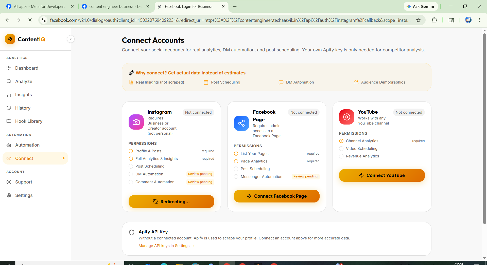

# Meta App 2 — Setup & App Review Guide
## App: `Content Engineer - Login` | App ID: `2169224913932416`
## Kaam: User Facebook/Instagram OAuth Login

> **Yeh app sirf user login ke liye hai — DM/comment automation isme nahi hoga.**
> App Review mostly NAHI lagti — basic permissions auto-approved hain.

---

## ═══════════════════════════════════════════
## STEP 1: Basic Settings
## ═══════════════════════════════════════════

**Path:** developers.facebook.com → App 2 → **App settings → Basic**

```
App Name:            Content Engineer - Login
App ID:              2169224913932416
App Secret:          95f6342307516e2ee5a4b81e9d04b944
App Contact Email:   contact@techaasvik.com
App Domains:         contentengineer.techaasvik.in
Privacy Policy URL:  https://contentengineer.techaasvik.in/privacy
Terms of Service:    https://contentengineer.techaasvik.in/terms
Category:            Business & Pages
```

**User Data Deletion:**
```
Dropdown: "Data deletion callback URL"
URL:      https://contentengineer.techaasvik.in/api/webhooks/data-deletion
```

**App Icon:** 1024x1024 PNG upload karo

→ **Save Changes**

---

## ═══════════════════════════════════════════
## STEP 2: Use Case Select Karo
## ═══════════════════════════════════════════

**Path:** App Dashboard → **Use cases** → Add

```
✅ Authenticate and request data from users with Facebook Login
   (Category: Others)
```

Sirf yahi ek use case chahiye.

---

## ═══════════════════════════════════════════
## STEP 3: Facebook Login → Settings
## ═══════════════════════════════════════════

**Path:** Left sidebar → **Facebook Login for Busi...** → **Settings**

```
Client OAuth Login:                   ✅ ON
Web OAuth Login:                      ✅ ON
Enforce HTTPS:                        ✅ ON
Force Web OAuth Reauthentication:     ❌ OFF
Embedded Browser OAuth Login:         ❌ OFF
Use Strict Mode for Redirect URIs:    ✅ ON
Login from Devices:                   ❌ OFF
Login with JavaScript SDK:            ✅ ON
```

**Valid OAuth Redirect URIs — yeh 4 add karo (exactly):**

```
https://contentengineer.techaasvik.in/api/connect/callback/instagram
https://contentengineer.techaasvik.in/api/connect/callback/facebook
http://localhost:3000/api/connect/callback/instagram
http://localhost:3000/api/connect/callback/facebook
```

**Allowed Domains for JavaScript SDK:**

```
contentengineer.techaasvik.in
localhost
```

**Deauthorize Callback URL:**

```
https://contentengineer.techaasvik.in/api/webhooks/deauthorize
```

**Data Deletion Request URL:**

```
https://contentengineer.techaasvik.in/api/webhooks/data-deletion
```

→ **Save Changes**

---

## ═══════════════════════════════════════════
## STEP 4: Permissions Add Karo
## ═══════════════════════════════════════════

**Path:** Use cases → "Authenticate and request data..." → **Customize → Permissions and features**

Sirf yeh 2 add karo:

```
✅ public_profile     ← Auto-granted (already added)
✅ email              ← Add karo
```

Baki sab SKIP karo — App 2 ke liye kuch aur nahi chahiye.

> ⚠️ **`instagram_basic` App 2 mein NAHI chahiye!**
> - `instagram_basic` Facebook Login use case ke Permissions section mein available hi nahi hoti
> - Instagram account connect karna **App 1 (Business App)** handle karta hai
> - App 2 ka kaam sirf user ko Facebook se login karana hai

---

## ═══════════════════════════════════════════
## STEP 5: Facebook Login → Quickstart
## ═══════════════════════════════════════════

**Path:** Facebook Login for Busi... → **Quickstart → Web**

```
Site URL:   https://contentengineer.techaasvik.in/
```

→ Save karo

---

## ═══════════════════════════════════════════
## STEP 6: App Roles — Testers Add Karo
## ═══════════════════════════════════════════

**Path:** Left sidebar → **App roles → Roles → Add people**

```
Apna Facebook account add karo as: Developer
Test karne wale logon ke accounts bhi add karo as: Tester
```

> Dev mode mein sirf Testers/Developers hi login kar payenge.

---

## ═══════════════════════════════════════════
## STEP 7: Live Mode ON Karo
## ═══════════════════════════════════════════

**Path:** App Dashboard → top mein toggle

```
Development → Live  (toggle karo)
```

Popup aayega → **"Switch to Live Mode"** confirm karo.

> ✅ `public_profile`, `email` — yeh dono auto-approved hain.
> Live mode mein koi bhi user login kar sakta hai — App Review ki zarurat NAHI.

---

## ═══════════════════════════════════════════
## APP REVIEW — Kya Submit Karna Hai?
## ═══════════════════════════════════════════

### ✅ App 2 ke liye App Review NAHI lagti!

| Permission | Review Status |
|---|---|
| `public_profile` | ✅ Auto-approved — no review |
| `email` | ✅ Auto-approved — no review |

> **Note:** `instagram_basic` App 2 mein add nahi hoti. Instagram connect karna App 1 (Business App) ka kaam hai.

> **Bas Live mode ON karo — kaam ho jayega.**
> App Review sirf App 1 (Business app) ke liye lagti hai jisme advanced permissions hain.

---

## ═══════════════════════════════════════════
## FUTURE: Agar Baad mein Aur Permissions Chahiye
## ═══════════════════════════════════════════

Agar kabhi App 2 mein extra permissions add karni padein (e.g., `user_friends`, `user_birthday`), tab App Review submit karna hoga. Tab neeche wala text use karna:

### Permission: `email`

**How will your app use this permission?**
```
Content Engineer uses the email permission to:

1. Identify returning users when they log in via Facebook Login
2. Pre-fill the registration form with the user's email address
3. Send account-related notifications (subscription confirmation, support replies)
4. Link the Facebook login to an existing Content Engineer account if the email matches

We do not use the email for marketing without explicit consent.
We do not share the user's email with any third party.
```

**Step-by-step instructions:**
```
Step 1: Go to https://contentengineer.techaasvik.in
Step 2: Click "Continue with Facebook" button on login page
Step 3: Facebook OAuth popup opens
Step 4: User grants: public_profile + email permissions
Step 5: Content Engineer reads the user's email from the API response
Step 6: If email matches an existing account → user is logged in automatically
Step 7: If new user → account is created with their name, profile picture, and email
Step 8: User is redirected to their Content Engineer dashboard
```

### Permission: `instagram_basic`

**How will your app use this permission?**
```
Content Engineer uses instagram_basic to:

1. Allow users to connect their Instagram account to Content Engineer via Facebook Login
2. Read the user's Instagram profile info (username, profile picture, follower count)
3. Display the connected Instagram account in the Content Engineer dashboard
4. Verify the Instagram account ownership before enabling automation features

We only read basic profile data — we do not post, message, or modify anything with this permission alone.
```

**Step-by-step instructions:**
```
Step 1: Go to https://contentengineer.techaasvik.in and log in
Step 2: Dashboard → Connected Accounts → "Connect Instagram"
Step 3: Facebook OAuth popup opens with instagram_basic permission requested
Step 4: User grants permission
Step 5: Content Engineer reads: Instagram username, profile picture, account ID
Step 6: Dashboard → Connected Accounts → Instagram account shows as "Connected"
        with username and profile picture displayed
Step 7: User can now set up automation rules for their Instagram account
```

---

## ═══════════════════════════════════════════
## ENVIRONMENT VARIABLES — App 2
## ═══════════════════════════════════════════

**Vercel Dashboard → Settings → Environment Variables mein yeh already set hain:**

```env
META_LOGIN_APP_ID=2169224913932416
META_LOGIN_APP_SECRET=95f6342307516e2ee5a4b81e9d04b944
```

**Kahan use hota hai code mein:**
```
/api/connect/callback/facebook  ← META_LOGIN_APP_ID use karta hai token exchange ke liye
/api/connect/callback/instagram ← META_LOGIN_APP_ID use karta hai Instagram OAuth ke liye
Login page → "Continue with Facebook" button → META_LOGIN_APP_ID
```

---

## ═══════════════════════════════════════════
## QUICK CHECKLIST — App 2
## ═══════════════════════════════════════════

```
☐ Settings → Basic — All URLs filled + App icon uploaded
☐ Use case: "Authenticate and request data with Facebook Login" added
☐ Facebook Login → Settings — OAuth settings configured
☐ Valid OAuth Redirect URIs — all 4 URLs added
☐ Allowed Domains — contentengineer.techaasvik.in + localhost
☐ Deauthorize URL: https://contentengineer.techaasvik.in/api/webhooks/deauthorize
☐ Data Deletion URL: https://contentengineer.techaasvik.in/api/webhooks/data-deletion
☐ Permissions added: public_profile, email (sirf yeh 2 — instagram_basic App 1 mein hoti hai)
☐ Quickstart Site URL set: https://contentengineer.techaasvik.in/
☐ App Roles → At least your own Facebook account added as Developer
☐ Live Mode: ON ← MOST IMPORTANT
☐ Test: Go to contentengineer.techaasvik.in → click Login → "Continue with Facebook"
         → Should work for any Facebook user (not just testers)
```

---

## ═══════════════════════════════════════════
## TESTING — Login Flow Test Karo
## ═══════════════════════════════════════════

**Live mode ON karne ke baad:**

```
1. Open: https://contentengineer.techaasvik.in/login
2. Click: "Continue with Facebook" button
3. Facebook login popup opens
4. Login with your Facebook account
5. Grant: public_profile + email
6. Should redirect to: https://contentengineer.techaasvik.in/dashboard
7. Dashboard mein apna naam + profile picture dikhe

Agar kaam kare → ✅ App 2 setup complete!
Agar error aaye → Check: Redirect URI in Facebook Login settings
```

---

## ═══════════════════════════════════════════
## SUMMARY
## ═══════════════════════════════════════════

| Task | Status |
|---|---|
| Basic Settings | Do it |
| Use Case (Facebook Login) | Do it |
| OAuth Redirect URIs | Do it |
| Permissions (3 basic ones) | Do it |
| App Review | ❌ NOT NEEDED |
| Live Mode | Do it — this is enough! |
| Business Verification | ❌ NOT NEEDED for App 2 |

> 🎉 **App 2 is the easy one — no App Review, no business verification needed.**
> Bas settings sahi karo aur Live mode ON karo — done!
